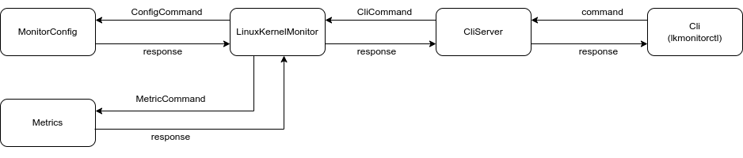

# Linux Kernel Monitor

[](LICENSE)

## Table of Contents

- [Introduction](#introduction)
- [Features](#features)
- [Installation](#installation)
- [Usage](#usage)
- [Configuration](#configuration)

## Introduction

This Linux Kernel Monitor was created as a practical testing exercise.  The project focuses on implementing a system monitoring tool capable of gathering vital kernel metrics.  It covers core aspects of system programming, including data collection, processing, multi-threading and output. The monitor is designed to be configurable and extensible, providing a foundation for more advanced monitoring features.

## Features

List the key features of your Linux Kernel Monitor. Be specific and highlight the benefits of each feature.  For example:

*   Collects CPU usage metrics (per-core).
*   Monitors memory usage (RAM, swap).
*   Tracks Disks info (name, mount point, etc.).
*   Configurable refresh rate.
*   Configurable metric threads.
*   Lightweight and efficient.
*   Output to journald.
*   Systemd service integration.

## Installation

Install dependencies:

Ubuntu:

    sudo apt install curl cargo
    cargo install cargo-deb

RedHat:

    yum install curl cargo
    cargo install cargo-rpm

Install Rust:

	curl --proto '=https' --tlsv1.2 -sSf https://sh.rustup.rs | sh

Run build.sh to build the project and generate installation package:
    
	./build.sh
    
Install package:

Ubuntu:
	
    sudo dpkg -i linux_kernel_monitor_*.deb
    
RedHat:
	
    sudo rpm -i linux_kernel_monitor_*.rpm
    

## Usage
1.  Start the service:

    	sudo systemctl start linux-kernel-monitor.service


2.  View the logs:

    	journalctl -u linux_kernel_monitor.service --no-pager

3. Cli:

The LKM service starts metrics in separate threads. You can stop them and run again with lkmonitorctl CLI (start/stop commands). Change refresh rate to increase/decrease interval between logging in journalctl in seconds (e.g. set --metric cpu --rate 10).
Use 'store' command to save current configuration in file that will be used during service startup later.



**Example:**
	
Find available commands in help:

    lkmonitorctl --help

Example:

Print all metrics:

    sudo lkmonitorctl list

Stop metric:

    sudo lkmonitorctl stop --metric io

Set refresh rate for 'cpu' metric:

    sudo lkmonitorctl set --metric cpu --rate 10

Start metric 'cpu':

    sudo lkmonitorctl start --metric cpu

Store configuration in file:

    sudo lkmonitorctl store

## Configuration

**Example `/etc/lkmoconfig.toml`:**

```toml
[cpu_config]
enabled = true
refresh_rate = 10

[memory_config]
enabled = true
refresh_rate = 10

[io_config]
enabled = false
refresh_rate = 1

